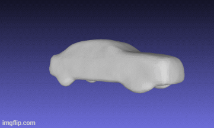
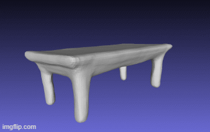
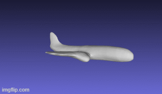
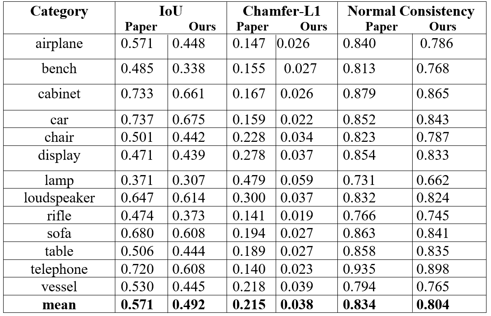

# 3D Object Reconstruction from Single Image using Occupancy Networks
Graduation Project — Zainab Ghanem & Nagham Noufal
<table>
  <tr>
    <td>
      
    </td>
    <td>
      
    </td>
    <td>
      
    </td>
  </tr>
</table>

### Project Overview

Reconstructing a complete 3D object from a single 2D image is a challenging problem in computer vision, as the input provides only partial information about the object's geometry, including surfaces and structures that may not be visible from the given viewpoint.

In this project, we reproduced the **single-image-to-mesh reconstruction** experiment from the [Occupancy Networks](https://github.com/autonomousvision/occupancy_networks) paper. The approach represents 3D geometry implicitly as a continuous **occupancy field**, allowing the model to predict whether arbitrary points in 3D space belong to the interior or exterior of an object.

The system takes a single RGB image as input. A **CNN-based encoder** extracts a latent representation of the image, which is then combined with sampled 3D query points and processed by the occupancy network. The resulting occupancy predictions define the object's implicit 3D surface, which is converted into a polygonal mesh using **MISE and Marching Cubes**.

We trained and evaluated the image-to-mesh model using a subset of the **ShapeNet** dataset. The original implementation and architecture were used as the foundation of the experiment, while configuration and compatibility modifications were introduced to make training feasible under our available computational resources.

Beyond reproducing the training pipeline, the project focuses on **evaluating and understanding the resulting reconstructions** through quantitative metrics such as **IoU, Chamfer distance, and Normal Consistency**, as well as qualitative inspection of the generated meshes.

The repository documents our experimental setup, modifications, results, analysis, and limitations, and provides an interactive demonstration of the trained model.

## Interactive Interface

A trained model is available through an interactive web interface, allowing users to upload a single RGB image and obtain a reconstructed 3D mesh.

**[Open the Interactive Demo](https://nagham-noufal-occupancy-network.hf.space/)**

The repository also includes a `samples/` folder containing example images from the test set that can be used directly with the interface. These samples correspond to objects evaluated using our trained model and provide an easy way to explore the reconstruction results.

## Experimental Setup

Our experiment focused exclusively on the **single-image-to-mesh** reconstruction task. We used a subset of the **ShapeNet** dataset and trained the Occupancy Networks model following the architecture and methodology provided by the original authors.

The original implementation was used as the foundation of the experiment, rather than developing a separate implementation of the architecture. Our work focused on reproducing the experiment, adapting the training configuration to our available environment, evaluating the resulting model, and analyzing its performance.

### Training Configuration

| Parameter           | Original Setup |       Our Setup |
| ------------------- | -------------: | --------------: |
| Task                |   Image → Mesh |    Image → Mesh |
| Dataset             |       ShapeNet | ShapeNet subset |
| Batch Size          |             64 |           **4** |
| Number of Layers    |              4 |           **1** |
| Training Iterations |    **300,000** |     **500,000** |
| Hardware            |            GPU |         **CPU** |
| Framework           |        PyTorch |         PyTorch |

The main configuration changes were necessary to make the experiment feasible under our computational constraints. In particular, the batch size and number of layers were reduced to accommodate CPU-based training and limited memory resources.

## Results

The trained model was evaluated on the test set using both **quantitative metrics** and **qualitative inspection of the reconstructed meshes**.

The main evaluation metrics include:

* **IoU (Intersection over Union):** measures the overlap between the reconstructed and ground-truth geometry.
* **Chamfer Distance:** measures the geometric distance between the reconstructed and reference surfaces.
* **Normal Consistency:** evaluates how closely the surface orientations of the reconstruction match the ground truth.

### Quantitative Results

The following table summarizes the main evaluation results obtained from our experiment.

For a more detailed analysis of the evaluation results, including metric distributions, and summary statistics, see the [`results_analysis.ipynb`](project/result/result_analysis.ipynb) notebook included in this repository.

### Qualitative Results

The repository also contains representative reconstructed meshes from the test set, see the `demo/` folder. These examples demonstrate that the trained model is capable of recovering plausible 3D geometry from a single input image, while also illustrating the variation in reconstruction quality across different objects. You may use an online external reader like **[IMAGEtoSTL](https://imagetostl.com/view-off-online)** to display the final reconstructed meshes.

## Limitations

The experiment was conducted under significantly more constrained computational conditions than the original experimental environment. We did not have access to a dedicated GPU and therefore had to perform training using CPU-based resources. This resulted in substantially longer training times and required reducing parts of the original configuration.

The main limitations of our experiment include:

* **CPU-only training**, resulting in long training times.
* **Reduced batch size** from 64 to 4.
* **Reduced network depth** from 4 layers to 1 layer.
* Use of a **subset of ShapeNet** rather than the complete dataset configuration.
* The resulting metrics therefore should **not be interpreted as a direct reproduction of the exact numerical results reported in the original paper**, since the experimental conditions differ.

Despite these limitations, we consider the experiment a successful reproduction and practical study of the Occupancy Networks image-to-mesh pipeline. Given our available hardware, memory, dataset constraints, and training time, we were able to train the model, generate 3D meshes from unseen images, evaluate the results quantitatively, and deploy the trained model through an interactive interface.

The project therefore demonstrates not only the application of Occupancy Networks for single-image 3D reconstruction, but also the practical considerations involved in reproducing a research system under constrained computational resources.

